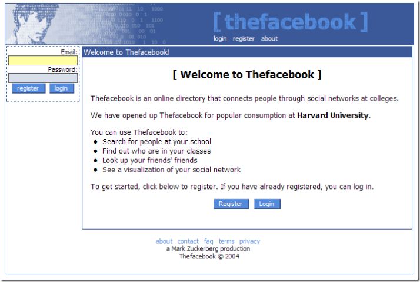
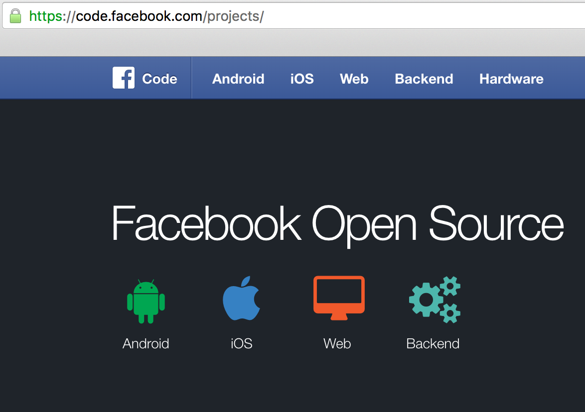
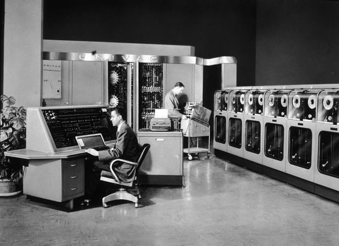
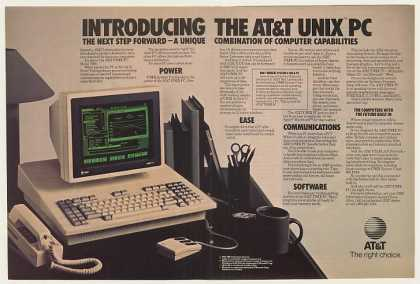
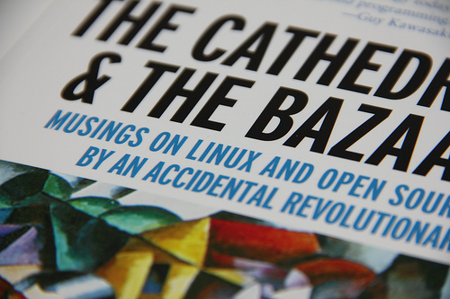
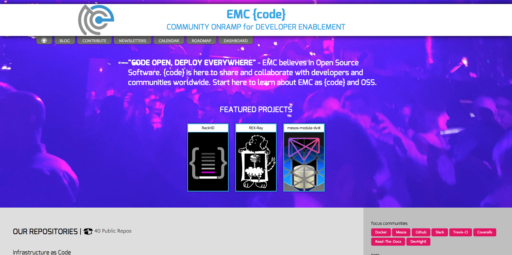

# Open Source.
## The Rise of Every Great Thing

^ On Feburary 4th, 2004. Mark Zuckerberg along with his Harvard roomates  Eduardo Saverin, Andrew McCollum, Dustin Moskovitz and Chris Hughes changed the face of history

---

^ the launch of thefacebook.com would prove to be the start of something unreal. something profound. something of great ordeal that would lead to an eventual valuation of 33 billion dollars.

^ But how did he do it? Zuckerberg's first server cost him $85/month. He rented this server and struggled to even pay the measly cost back at that time. Today, facebook has nearly 30,000 servers deployed world-wide. But let's touch on that first server.

^ Understand that facebook was not Mark's first endeavour. He created a few different applications like facesmash, which got him in trouble with Harvard. So how was Mark able to create applications at such as rapid rate?

---

^ It was pretty standard in the 2000's to run a LAMP Stack. Each one of these pieces represent critical parts of a tool chain in hosting an application. But what do they all have in common? They are OSS. Taking something that is readily available and free is what allowed him to create things at a rapid pace. Of course, facebook has matured from this model but still hangs tight to its original roots.

---

- Facebook is both a consumer of and contributor to free and open source software. 
- Facebook's contributions include: HipHop for PHP, Fair scheduler in Apache Hadoop Apache Hive, Apache Cassandra, and the Open Compute Project
- Facebook also contributes to other opensource projects such as Oracle's MySQL database engine

^ Facebook is built in PHP which is compiled with HipHop for PHP, a 'source code transformer' built by Facebook engineers that turns PHP into C++.[169] The deployment of HipHop reportedly reduced average CPU consumption on Facebook servers by 50%

---

# Moving Fast

- Industries of: :airplane: - :high_heel: - :dollar: - :car: - :newspaper: - :movie_camera:
- StartUps come with a fresh perspective
- StartUps have little to no financial resources
- Global Collaboration (acceleration)
- Nothing to hide (bug-fixes, features, security)

^ Facebook is a prime example as moving fast. But think about all the startups that are out to eat the lunch of every big game on the market. Industries of travel, retail, banking, transportation, newspapers, entertainment and more are seeing new startups enter the market every day. But how are they doing it?

^  StartUps come with a fresh perspective. They don't need to maintain the baggage that weighs down many tradaitional IT departments. They look at the landscape and focus on a new way to do things. Many places get into a cycle of keeping the lights on and not trying to innovate. That percentage to innovate is given 100% to startups. They can come to market with something and pivot. A great example of this would be Slack. The company original started making a web-based multiplayer game and failed. Out of it came a communication tool that is utilized world-wide and has over taken popular platforms like IRC.

^ Unless you somehow got an angel round funding on nothing more than idea, the odds are you start money out of your own pocket. No fancy offices, no catered lunches, taking public transportation, no expensive steak dinners. just some drive and determination and maybe a few servers in AWS. The last thing you have is money to spend on proprietary software. This is where the world of OSS truly begins to shine. OSS brings lots of value. first it's free. free as in free speech. Whether you need a web server, a database, a big data analytics engine, a logging stack, or even an integration with a popular web service, 9 times out of 10, there is an OSS project that will fit your need. This is where startups can take the work that has been set forth before them and create their own value on top of it. This where the popular phrase comes in "We stand on the shoulders of giants"

^ If your code is out there, it enables global collaboration. If your project shows potential, it has the ability to go viral and catch the attention of hundreds of thousands of developers. when you've got that many eyes on your code, it leaves room for improvement. More people can join in to create bugfixes, enhance features, close security issues and more. All of this combined leads to accelerated growth and maturity of your project, all without overhead cost of hiring.

---

# Is OSS New?

- The short answer: **NO**
- The long answer: **YES**

^ In the 1950s and into the 1960s almost all software was produced by academia and corporate researchers working in collaboration. As such, it was generally distributed under the principles of openness and co-operation long established in the fields of academia, and was not seen as a commodity in itself. At this time, source code, the human-readable form of software, was generally distributed with the software itself because users frequently modified the software themselves, because it would not run on different hardware or OS without modification, and also to fix bugs or add new functionality.

---

## The A-2 system was released to customers with its source code.

^ developed at the UNIVAC division of Remington Rand in 1953, was released to customers with its source code. They were invited to send their improvements back to UNIVAC. Thus it is believed that A-2 was the first example of free and open-source software.

^ As large-scale operating systems matured, fewer organizations allowed modifications to the operating software, and eventually such operating systems were closed to modification. However, utilities and other added-function applications are still shared and new organizations have been formed to promote the sharing of software.

---

## United States vs. IBM antitrust suit, filed 17 January 1969, the U.S. government charged that bundled software was anticompetitive

^ By the late 1960s change was coming: as operating systems and language compilers evolved, software production costs were dramatically increasing. A growing software industry was competing with the hardware manufacturers' bundled software products, which is the cost of bundled products was included in the hardware cost. Of course, many customers didn't want this. In the United States vs. IBM antitrust suit, filed 17 January 1969, the U.S. government charged that bundled software was anticompetitive. While some software continued to come at no cost, there was a growing amount of software that was for sale only under restrictive licenses.

---

## In the early 1970s AT&T distributed early versions of UNIX at no cost to government and academic researchers. After UNIX became more widespread in the early 1980s, AT&T stopped the free distribution and charged for system patches

^ In the early 1970s AT&T distributed versions of UNIX at no cost to government and academic researchers, but these versions did not come with permission to redistribute or to distribute modified versions, and were thus not free software in the modern meaning of the phrase. After UNIX became more widespread in the early 1980s, AT&T stopped the free distribution and charged for system patches. As it is quite difficult to switch to another architecture, most researchers paid for a commercial licence.

^ In the late 1970s and early 1980s, computer vendors and software-only companies began routinely charging for software licences, marketing it as "Program Products" and imposing legal restrictions on new software developments, now seen as assets, through copyrights, trademarks, and leasing contracts. In 1979, AT&T began to enforce its licences when the company decided it might profit by selling the Unix system.

---

## In 1983, Richard Stallman published the GNU Manifesto and launched the GNU Project

^In 1983, Richard Stallman published the GNU Manifesto and launched the GNU Project to write a complete operating system free from constraints on use of its source code. Particular incidents motivated this. One case includes an annoying printer couldn't be fixed because the source code was withheld from users. The GNU Manifesto outlined the GNU project's purpose and explained the importance of free software. Soon after the launch, he coined the term "free software" and founded the Free Software Foundation to promote the concept and a free software definition was published in February 1986

---

## The Linux kernel, started by Linus Torvalds, was released as freely modifiable source code in 1991

^ The Linux kernel, started by Linus Torvalds, was released as freely modifiable source code in 1991. The licence wasn't a free-software licence, but in February 1992, Torvalds relicensed the project under the GNU General Public License. Much like Unix, Torvalds' kernel attracted the attention of volunteer programmers everywhere.

^ Until this point, the GNU project's lack of a kernel meant that no complete free-software operating systems existed. The development of the Linux kernel closed that last gap. The combination of these two made the first complete free-software operating system.

---

## In 1997, Eric Raymond published The Cathedral and the Bazaar, a reflective analysis of the hacker community and free-software principles.

^ In 1997, Eric Raymond published The Cathedral and the Bazaar, a reflective analysis of the hacker community and free-software principles. The paper received significant attention in early 1998 and was one factor in motivating Netscape to release their popular Netscape Communicator Internet suite as free software. This code is today the basis for Mozilla Firefox and Thunderbird.

^ Netscape's act prompted Raymond and others to look into how to bring free-software principles and benefits to the commercial-software industry. They concluded that FSF's social activism was not appealing to companies like Netscape, and looked for a way to rebrand the free-software movement to emphasize the business potential of the sharing of source code.

---

## Since its first public release in 1996, the Java platform had not been open source. On 8 May 2007, Sun Microsystems released the Java Development Kit as OpenJDK under the GNU General Public License.

^ Since the 1990s, the release of new programming languages in the form of open source compilers or interpreters has been the norm, rather than the exception. Examples include Python in 1991, Ruby in 1995 and Scala in 2003. In recent times, the most notable exceptions have been Java, ActionScript and C# also Apple's Swift until version 2.2 was proprietary.

^ Since its first public release in 1996, the Java platform had not been open source. In 2006 Jonathan I. Schwartz became CEO of Sun Microsystems, and signaled his commitment to open source. On 8 May 2007, Sun Microsystems released the Java Development Kit as OpenJDK under the GNU General Public License.

---

## The first open source distributed revision control system (DVCS) was tla in 2001 (since renamed to GNU arch). Git, which has since become the most popular DVCS, was created in 2005

^ The story of git's creation is an unusual one. Some developers of the Linux Kernel started to use a proprietary DVCS called BitKeeper, notably Linux founder Linus Torvalds, although some other kernel developers never used it due its proprietary nature. The unusual situation whereby Linux kernel development involved the use by some of proprietary software "came to a head" when Andrew Tridgell started to reverse-engineer BitKeeper with the aim of producing an open source tool which could provide some of the same functionality as the commercial version. BitMover, the company that developed BitKeeper, in response, in 2005 revoked the special free-of-charge license it had granted to certain kernel developers.

^ As a result of the removal of the BitKeeper license, Linus Torvalds immediately decided to write his own DVCS, called git, because he thought none of the existing open source DVCSs were suitable for his particular needs as a kernel maintainer (which was why he had adopted BitKeeper in the first place). A bunch of other developers quickly jumped in and helped him, and git over time grew from a relatively simple "content tracker" into the sophisticated and powerful DVCS that it is today.

---

## GitHub was launched in April 2008 and today hosts more than 15,000,000 repositories with a growth rate of 5000 repos/day.

^Development of the GitHub platform began on 1 October 2007. The site was launched in April 2008 by Tom Preston-Werner, Chris Wanstrath, and PJ Hyett after it had been made available for a few months prior as a beta period.

^Projects on GitHub can be accessed and manipulated using the standard Git command-line interface and all of the standard Git commands work with it. GitHub allows registered and non-registered users to browse public repositories on the site. Multiple desktop clients and Git plugins have been created by GitHub and other third parties to integrate with the platform.

^The site provides social networking-like functions such as feeds, followers, wikis and a social network graph to display how developers work on their versions of a repository and what fork and branch within that fork is newest.

^A user must create an account in order to contribute content to the site, but public repositories can be browsed and downloaded by anyone. With a registered user account, users are able to discuss, manage, create repositories, submit contributions to other repositories, and review changes to code.

^Today, GitHub hosts more than 15,000,000 repositories with a growth rate of 5000 repos/day. It's the defacto standard for placing OSS projects, thus, many people picture GitHub as the central onramp for open source. 

---

# Embracing The Change

- Many proprietary products use OSS
- Microsoft Open Sources .NET Framework

^ Today, you can't get away from OSS. It's all around you. Can anyone answer what the most popular open source project is to date? It's Linux. With 800,000+ lines of code and 573,000+ commits, it continues to grow with more being done every hour. There are also other OSS projects like Apache HTTP webserver that is used in over 50% of all websites on the planet. Or OpenSSL which does certificate encrypting for nearly every product in existence. 

^ On November 12, 2014, Microsoft releases the .NET Framework to be open source and cross-platform. This was a necessary move by Microsoft to keep it's landgrab of .NET developers happy as more open source languages are becoming the standard for many classes. In addition, making the framework capable of running on linux extends its footprint even further

---

## Infrastructure.NEXT
-
-
-
## containers

As of October 24, 2015, Docker has over 25,600 GitHub stars (making it the 20th most-starred GitHub project), over 6,800 forks, and nearly 1,100 contributors

^ Everything progresses. What's old is new again. This is where we see the rise of the container. Docker was released as open source in March 2013. On March 13, 2014, with the release of version 0.9, Docker dropped LXC as the default execution environment and replaced it with its own libcontainer library written in the Go programming language. As of October 24, 2015, the project had over 25,600 GitHub stars (making it the 20th most-starred GitHub project), over 6,800 forks, and nearly 1,100 contributors.

---

# Containers != Cloud Native

- Two camps of P3
- We focus on the plumbing of cloud native infrastructure

^ You can take one approach of CNA and P3, that just means to re-design my application or i need to re-platform or make it 12-factor by re-writing it or bringing in development-firm to make it happen. It's a ton of work to get it to cloud-native. But when you talk to startups or people in OSS world, others look at containers in a different way. Virtual Machines provide the abstraction of storage, networking, and compute, but you can't provide the "deploy everywhere" approach because of hypervisor lock-in, cloud lock-in, etc. it doesn't make the VM portable at the end of the day. So if you're focused on the core aspect of infrastructure at the end of the day and not just applications, then there are better ways to do VMs and those are containers. It's really VM.next. So there's two camps. First one says I need to take my applications and re-write it to take advantage of these environments. Then the other camp says i can think of containers like VMs.next as an open source free thing. So you don't necessarily need to take you applications to the CN application architecture level, but you can embrace and use the CN infrastructure. You will see us talk about containers a lot, but not the applications that are ran inside of the containers because that's going to be more of a pivotal thing.

---

# What Does OSS Mean to EMC?

- EMC {code} formation and strategy 
- Being a Good OSS Citizen
- Enterprise Features -- HA, Clustering, and Container Scheduling Layer
- * as {code}
- Focused but also open to all container runtimes and schedulers

^ If you think about the container space, Docker, Mesosphere, they are thinking about how to monetize OSS. One of the answers is obviously where we sit. We've mastered the turn-key solution or turn-key product that organization pay a dollar figure and it just works and we support it. The enterprise has expectations of what capabilities come out of the box for that solution under-the-hood. The next step is not "how i run my containers" like on Docker or Mesos, but how I use a scheduler and how I turn a container host into a cluster. The companies that build their platform to run containers like google or apple, and they've done containers the right way where its 12-factor the applications are abstracted from the infrastrucutre completely, but the enterprises that want to consume containers are going to care about the scheduling and clustering because they want something for their important workloads that aren't necessarily cloud-native, but can be containerized. So if my postgres or mysql database that is containerized lives on a host, and that host dies, we want to make sure that's restarted somewhere else. The focus we are seeing a ton in this scheduling layer because the enterprise is looking for a simple solution. It's really a VMware.next view for a new way to run infrastructure instead of re-design my app-view.

^ Everything as code. EMC as code is another way to think about the {code} team delivering EMC technology as a way that's friendly to developers, which is code. You're going to see us start building a category of storage as code, and perhaps building out other ones. 

^ We've got a core project that we will talk about but when we are developing these core projects we don't want to write them in a way that they are hyper-focused and tied to a single entity. We have to build in open and abstract ways. The battle of what container run-time will win is happening right now. Of course, we all know about Docker but there are plenty of others out there trying to eat their lunch. We all know how fast they moved, someone else could move just as fast. In 3 years, we don't know. There may be other container run-times that use part of the Docker code. So we have to be open to the changing landscapes.

---

# Focused Projects

---
# REX-Ray

- https://github.com/emccode/rexray
- Persistent Storage Access for Container Runtimes
- REX-Ray 0.3.1 released 12/30/15
    + VMAX, Isilon, GCE, Virtualbox
    + Pre-Emption Support

^ REX-Ray is all about storage persistence. Right now it is the glue between Docker and Mesos and EMC II and other Clouds. Think of it like the Vipr-C or Cinder of the container world. REX-ray is fundamental to our focus areas because it enables EMC II to be relevant in these new worlds so we talk about it a lot. We can bring EMC ideas and technology into projects through plugins and schedulers. We will show a demo of this a little bit later. REX-Ray a ton of EMC things. Outisde of EMC we support AWS, GCE, VirtualBox, and Cinder. Cinder opens the door for basically every OpenStack deployment that's out there and wants to utilize container technologies within those VMs. A major feature is pre-emption, which gets us further into HA and enterprise features. Without this, say a container scheduler restarts a container with a persistent volume on another host. The container will fail to persist data because the volume is locked and attached to the original host. Pre-emption support enables REX-ray to forcefully remove a volume from an existing host and bring it to the host that requested the volume. So in the case of HA or reschduleing, the container's data will follow it whereever it gets rescheduled. this is analgous to Vmware HA.

---

#mesos-module-dvdi

- https://github.com/emccode/mesos-module-dvdi
- enables existing Docker Volume Drivers to be used without Docker.
- mesos-module-dvdi 0.3
    + 0.23, 0.24, 0.25, 0.26
    + Mesos Containerization

^ The next major release was 0.3 for mesos-module-dvdi. This was a big deal because this brings support for mesos volumes. so if you are using any framework with mesos such as hadoop, cassandra, or any other scheudlers, you can specify the native mesos containerization to bring volumes to the workload. Because previously we only supported the docker volume driver. We also adapted it versions 23, 24, 25, 26 which hopefully supports many of the wider spread versions being ran in the community. 

---

# RackHD

- https://github.com/RackHD/RackHD 
- Bare-metal orchestration with a work flow engine
-  1.0

^ RackHD 1.0 got released end of december. the early phase is about awareness and get hands-on. so you can get stated learning about the API and the uniqueness it brings to market. So we have a video and a blog post showcased. So any developer that wants to get started has an easy barrier to entry. You can go to the project and spin up a vagrant box to get started

---

# Find Us

## emccode.github.io
-
### http://github.com/emccode/roadmap
### http://github.com/emccode/conferences

